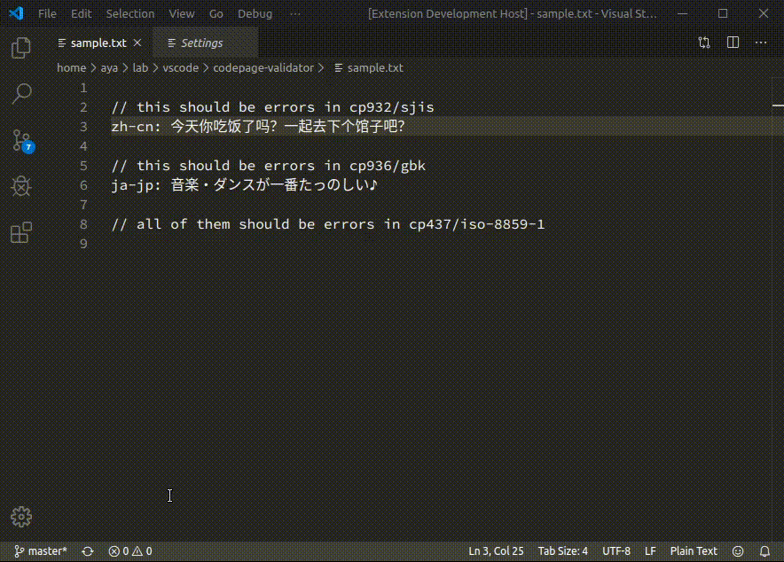

# codepage-validator README

Check if the text works in _given_ charset/codepage/encoding. If not, the plugin will highlight them.

## Features

Steps:
1. Open a text file.
2. Set the charset you want to match.
3. Non-compatible characters will be highlighted (for example, red).

## Extension Settings

Target encoding:
* `codepageValidator.Charset` → `Shift_JIS`

Highlight text style:
* `codepageValidator.Style.Foreground` → `red`
* `codepageValidator.Style.Background` → `transparent`

Validate when editing:
* `codepageValidator.RealTime` → `true`

## Known Issues

* [Upstream](https://github.com/microsoft/vscode/issues/824): It is _impossible_ to add an option auto picking the encoding.
* The compatible version is not tested. This plugin may work or not work on vscode older than 1.41.0.

## Release Notes

### 0.1.0

Initial release of **Code Page Validator**.
